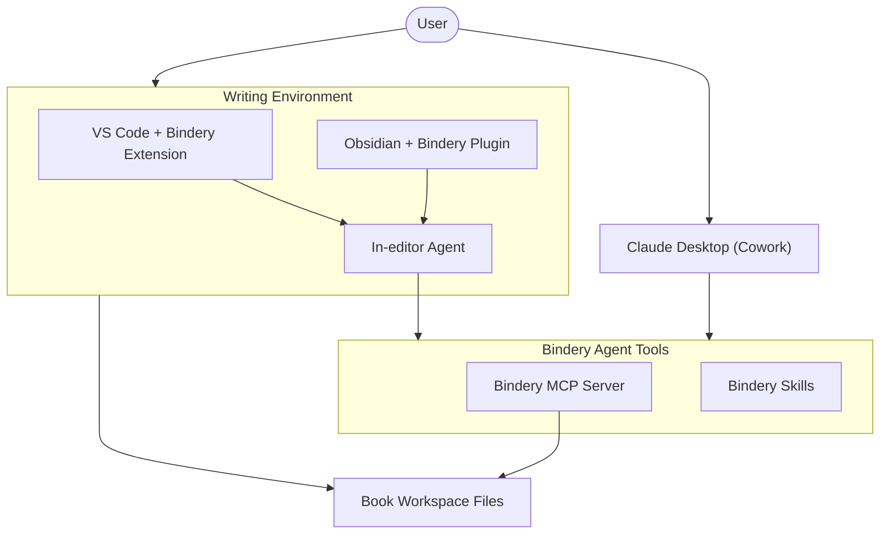

# Bindery

Markdown book authoring toolkit: **VS Code extension + Obsidian plugin** for typography formatting and multi-format export, paired with an **MCP server** for full-text search and AI assistant integration.

## Origin

This project started as a personal writing tool, born out of frustration with the copy-paste loop that most AI-assisted writing ends up as.

It started with Word and ChatGPT: writing a chapter, copying it into the browser, getting feedback, pasting it back. Versioning was an issue and keeping the ChatGPT project up to date with recent .docx files was a lot of work. Moving to VS Code and Markdown files seemed like the natural next step: plain text, version control, and the ability to plug in an MCP server so an agent like Codex could read the book directly.

In practice though, I still fell back to copy-pasting for feedback and only really used the tooling for typography formatting. Most VS Code extensions are built for coding: short iterations where the code is the truth, rather than the longer-running, chat-based sessions you get in web tools. That frustration is what pushed the VS Code extension into existence. At minimum, the formatting and exporting should just work without any ceremony.

The bigger shift came with Claude Cowork, which combines the session memory of a long-running agent with direct file access. That made the MCP server genuinely useful: the agent could navigate chapters, search for context, and keep track of the story across a session without being handed everything manually. The extension and MCP server now support both workflows: VS Code agents (Copilot, Codex, Claude for VS Code) and standalone Claude Desktop / Cowork. And a Obsidian plugin with the same functionality as the VS Code extension for users that don't work with a more development minded VS Code.

## Components

### [vscode-ext/](vscode-ext/) — VS Code Extension

The **Bindery** extension provides:

- **Typography formatting** — curly quotes, em-dashes, ellipses, smart apostrophes (on save or on demand)
- **Chapter merge & export** — Markdown, DOCX, EPUB, PDF output via Pandoc + LibreOffice, with auto-detection of tool paths
- **Dialect & translation management** — extensible substitution rules for dialect exports (e.g. US→UK), plus cross-language glossaries in `.bindery/translations.json`
- **Multi-language support** — configurable per-language chapter labelling and folder structure, with dialect derivatives
- **Opinionated workspace setup** — `.bindery/settings.json` plus Arc, Notes, Characters, SESSION, PREFERENCES, memory, and chapter-status scaffolding
- **MCP integration** — registers 38 Bindery tools for GitHub Copilot Chat and writes `.vscode/mcp.json` for Claude / Codex

Install from the [VS Code Marketplace](https://marketplace.visualstudio.com/items?itemName=option-a.bindery) or:

```bash
cd vscode-ext
npm install
npm run compile
npx @vscode/vsce package
```

See [vscode-ext/README.md](vscode-ext/README.md) for full documentation.

### [mcp-ts/](mcp-ts/) — MCP Server (Node.js / TypeScript)

A [Model Context Protocol](https://modelcontextprotocol.io/) server that exposes your book project to AI assistants. Pure Node.js.

- **BM25 full-text search** — fast lexical search across all chapters and notes via [MiniSearch](https://lucaong.github.io/minisearch/)
- **Optional semantic search** — set `BINDERY_OLLAMA_URL` for semantic reranking, or enable a full semantic index for precomputed embedding search
- **Version tracking** — `get_review_text` returns a structured git diff **plus** any regions wrapped in `<!-- Bindery: Review start --> ... <!-- Bindery: Review stop -->` markers (so committed work-in-progress can still be reviewed). `git_snapshot` saves progress as a git commit. Git is auto-initialized during workspace setup if available
- **Translation & dialect management** — glossary entries and dialect substitution rules in `.bindery/translations.json`, queryable and updatable by agents
- **Opinionated authoring scaffold** — `init_workspace` creates `SESSION.md`, `PREFERENCES.md`, `Arc/index.md`, `Arc/Overall.md`, `Arc/Acts/`, `Notes/Inbox.md`, `Notes/Characters/index.md`, structured note folders, `.bindery/memories/global.md`, and `.bindery/chapter-status.json`
- **Story note management** — agents can list, read, create, and append notes under the configured notes folder while `get_notes` remains compatible with older recursive note layouts
- **Session memory** — persistent `.bindery/memories/` files for cross-session decisions, with append, list, and compact operations
- **Session focus** — `session_focus_*` tools maintain the ephemeral working-state file `SESSION.md` (current focus, next actions, open questions, handoff); durable preferences live in the user-owned `PREFERENCES.md`
- **Inbox triage** — `inbox_process` enumerates loose items in `Notes/Inbox.md` and proposes destinations (read-only); `inbox_resolve` clears items after they are routed and confirmed — rough/pasted material goes to the Inbox, not memory
- **Chapter status tracking** — per-chapter progress tracker (`draft`, `in-progress`, `done`, `needs-review`)
- **Structured arc & character management** — agents can create/update arc files and character profiles using structured tools that keep indexes in sync
- **Host command parity** — VS Code and Obsidian expose command-palette actions for notes, characters, arcs, memory, and chapter status, backed by the same structured tool functions agents use
- **Multi-book support** — configure one or more books via `--book Name=path` CLI args or `BINDERY_BOOKS` env var; every tool call specifies which book to use by name (agents never see raw paths)
- **Container/mount aware** — agents in sandboxed environments (e.g. Cowork) can call `identify_book` with their working directory to discover their book name, even when mount paths differ from the configured paths

See [mcpb/README.md](mcpb/README.md) for the full 40-tool reference and usage examples.

### [obsidian-plugin/](obsidian-plugin/) — Obsidian Plugin

The **Bindery** Obsidian plugin provides the same feature set as the VS Code extension for Obsidian vault users:

- **Typography formatting** — curly quotes, em-dashes, ellipses, smart apostrophes (on save or on demand)
- **Chapter merge & export** — Markdown, DOCX, EPUB, PDF output via Pandoc + LibreOffice
- **Dialect & translation management** — extensible substitution rules and glossaries
- **Multi-language support** — configurable per-language chapter labelling
- **Opinionated workspace setup** — `.bindery/settings.json` plus Arc, Notes, Characters, SESSION, PREFERENCES, memory, and chapter-status scaffolding
- **AI instruction generation** — Generate CLAUDE.md, copilot-instructions.md, .cursor/rules, AGENTS.md
- **Review markers** — Mark regions for agent feedback
- **Opinionated authoring commands** — command-palette actions for notes, characters, arcs, memory, and chapter status
- **MCP snippet generator** — Copy JSON for Claude Desktop integration

Build and install:

```bash
cd obsidian-plugin
npm install
npm run compile
npm run bundle
# out/main.js is ready for manual Obsidian installation
```

Then in Obsidian: Settings → Community plugins (if not restricted) → Install from folder or manual install from `out/main.js`.

### [mcpb/](mcpb/) — Claude Desktop Extension

Packages the MCP server as a `.mcpb` file for one-click installation in Claude Desktop or Cowork.

**Download the latest release** from [Releases](../../releases) — no build step needed.

## Quick Start

### VS Code (Copilot / Claude / Codex)

1. Install the [Bindery extension](https://marketplace.visualstudio.com/items?itemName=option-a.bindery) from the Marketplace
2. Open your book folder in VS Code
3. Run `Bindery: Initialize Workspace` to create `.bindery/settings.json`, `.bindery/translations.json`, the generated `.bindery/README.md` capability reference, and the opinionated Arc / Notes / Characters / SESSION / PREFERENCES / memory / status scaffold
4. Run `Bindery: Register MCP Server` to create `.vscode/mcp.json` (primarily for Claude/Codex discovery; not needed for GitHub Copilot Chat because the extension registers the tools automatically)
5. Tools are now available in GitHub Copilot Chat, Claude for VS Code, and Codex

### Claude Desktop / Cowork

1. Download `bindery-mcp-*.mcpb` from the [latest release](../../releases/latest)
2. Open Claude Desktop → Settings → Extensions → Install from file
3. Fill in the **Books** field with semicolon-separated `Name=path` pairs:
   `ScaryBook=C:\Users\My\Projects\ScaryBook;MyNovel=D:\Writing\MyNovel`
4. Optionally set the **Ollama URL** if you want semantic reranking
5. Optionally enable the semantic index and choose a default search mode if you want `full_semantic` search with rebuild warnings when the embedding index becomes stale.
   - **Note:** full embedding can be a heavy operation, depending on your hardware, when running a local Ollama instance.
6. Tools are now available — the agent calls `list_books` to discover book names

## Architecture Overview

The following flow shows how Bindery's writing environments connect to agents, MCP, and skills at a high level.



### Formatting & Export only (no MCP)

The VS Code extension and Obsidian plugin both work standalone — no server setup needed for typography formatting and export.

## Project Structure

```
├── bindery-core/        Shared templates & types (TS)
│   ├── src/
│   │   └── templates/   AI instruction templates (claude, copilot, cursor, agents, skills)
│   └── package.json
├── bindery-merge/       Shared merge logic (TS)
│   ├── src/
│   │   ├── merge.ts     Chapter discovery, merge, export via Pandoc/LibreOffice
│   │   └── tool-locate.ts   Cross-platform tool path resolution
│   └── package.json
├── vscode-ext/          VS Code extension (TS)
│   ├── src/
│   ├── package.json
│   └── README.md
├── obsidian-plugin/     Obsidian plugin (TS)
│   ├── src/
│   ├── package.json
│   └── README.md
├── mcp-ts/              MCP server (Node.js / TS)
│   ├── src/
│   └── package.json
├── mcpb/                Claude Desktop extension
│   ├── manifest.json
│   └── server/          (CI-populated)
└── LICENSE
```

Shared logic in `bindery-core` and `bindery-merge` ensures both `vscode-ext` and `obsidian-plugin` implement identical functionality.

## Prerequisites

- **One writing environment**:
  - **VS Code** 1.85+
  - **Obsidian Desktop** with Community Plugins enabled
- **Git** (recommended) — needed for version tracking, `get_review_text`, and `git_snapshot`. Auto-initialized during workspace setup.
  - Install via package manager or from [https://git-scm.com](https://git-scm.com)
- **Pandoc** (optional) — needed for DOCX/EPUB/PDF export.
  - Install via package manager or from [https://pandoc.org/installing.html](https://pandoc.org/installing.html)
- **LibreOffice** (optional) — needed for PDF export only.
  - Install via package manager or from [https://www.libreoffice.org](https://www.libreoffice.org)
- **Ollama** (optional) — needed for semantic reranking and search.
  - Install via package manager or from [https://ollama.com/](https://ollama.com/)

### Pandoc / LibreOffice auto-detection

On all platforms the extension resolves tool paths in this order:

1. Explicit `bindery.pandocPath` / `bindery.libreOfficePath` user setting (if set and the file exists)
2. Command on `PATH` (`where.exe` on Windows, `which` elsewhere)
3. Well-known install locations:
   - **Windows**: `%LOCALAPPDATA%\Pandoc\pandoc.exe`, `%ProgramFiles%\Pandoc\pandoc.exe`, `%ProgramFiles%\LibreOffice\program\soffice.exe`
   - **macOS**: `/opt/homebrew/bin/pandoc`, `/usr/local/bin/pandoc`, `/Applications/LibreOffice.app/Contents/MacOS/soffice`
   - **Linux**: `/usr/bin/pandoc`, `/usr/bin/libreoffice`

You usually do not need to configure anything — install Pandoc/LibreOffice normally and exports will work. Use the `bindery_health` MCP tool to see what was detected.

## Known limitations

- **Git** must be on `PATH` (or at a standard install location) for `get_review_text` and `git_snapshot`. If git isn't found, these tools fail with a clear error; all other tools still work.
- **Pandoc** is required for DOCX, EPUB, and PDF export. Markdown-only export has no external dependencies.
- **LibreOffice** is required only for PDF export. Bindery generates PDFs by producing a DOCX via Pandoc and then converting with LibreOffice headless.
- **Semantic search** requires an optional [Ollama](https://ollama.com/) instance. Without it, lexical BM25 search still works offline. Configure with `BINDERY_OLLAMA_URL`; optional tuning via `BINDERY_OLLAMA_TIMEOUT_MS` (default 15000) and `BINDERY_OLLAMA_RETRIES` (default 1).
- **Large books with semantic indexing** can take several minutes to embed on first build. Rebuilds are incremental when chapter content is unchanged.
- **Chapter numbering**: the tools sort chapters by filename but accept non-contiguous numbers. `get_overview` now flags gaps (e.g. chapters 1, 3 with no 2) as a warning.
- **Search index format**: bumped automatically when the on-disk format changes. Older indexes are silently ignored and rebuilt on next use — no manual action required.

## Privacy

Bindery stays within your workspace, only if the optional Ollama URL is filled for the MCP server will texts be sent to Ollama for embedding / semantic search. The full privacy policy can be viewed at [https://evdboom.nl/projects/bindery/privacy](https://evdboom.nl/projects/bindery/privacy)

## License

MIT — see [LICENSE](LICENSE).

## Contributing — template source of truth

## Host Parity Reminder

`vscode-ext/` and `obsidian-plugin/` are **two equal implementations** of the same Bindery authoring toolkit. Both support:

- **Typography formatting** (curly quotes, em-dashes, ellipses)
- **Chapter merge & export** (MD, DOCX, EPUB, PDF via Pandoc + LibreOffice)
- **Dialect & translation management** — extensible substitution rules and glossaries
- **Multi-language support** — configurable chapter labels and folder structures
- **Workspace initialization** — `.bindery/settings.json`, `.bindery/translations.json`, generated `.bindery/README.md`, and the opinionated Arc / Notes / Characters / SESSION / PREFERENCES / memory / status scaffold
- **AI instruction generation** — CLAUDE.md, copilot-instructions.md, .cursor/rules, AGENTS.md
- **Review markers** — wrap text in `<!-- Bindery: Review start/stop -->` for agent feedback
- **MCP config snippet** — JSON for Claude Desktop / Cowork integration
- **Workspace management** — add languages, dialects, and translation entries

Both plugins share all core logic via `@bindery/merge` (chapter discovery, merge execution, tool path resolution) to minimize duplication and ensure consistent behavior. Shared templates in `@bindery/core/src/templates/` feed both VS Code and Obsidian workflows.

Unless a change is intentionally host-specific, functional additions to one should be mirrored in the other in the same PR or a clearly linked follow-up PR.

The AI instruction file templates are maintained in **one place only**:

```
bindery-core/src/templates/*.ts   ← SINGLE SOURCE OF TRUTH (one file per template)
```

`mcp-ts/src/templates.ts` is a thin re-export shim to keep existing imports stable. Consumers should continue importing from their local package entrypoint,
but template edits belong in the matching file under `bindery-core/src/templates/`.

### Syncing locally

After changing files under `bindery-core/src/templates/`, rebuild and test the workspace:

```bash
npm run build --workspace=bindery-core
npm test --workspace=bindery-core
npm test --workspace=mcp-ts
npm test --workspace=vscode-ext
npm test --workspace=obsidian-plugin
```

### Running tests

```bash
# Shared packages
cd bindery-core && npm test
cd bindery-merge && npm test

# MCP server
cd mcp-ts && npm test

# VS Code extension
cd vscode-ext && npm test

# Obsidian plugin
cd obsidian-plugin && npm test
```

### What CI does

The CI workflow (`.github/workflows/ci.yml`) runs on every push and pull request:

1. Builds and tests `bindery-core`, `mcp-ts`, `vscode-ext`, and `obsidian-plugin` (Ubuntu, Windows, macOS).
2. Runs the **tool parity guard** (`scripts/check-tool-parity.mjs`) and **command parity guard** (`scripts/check-command-parity.mjs`) on the coverage job.
3. Enforces **coverage thresholds** (statements 80%, branches 65%, functions 90%, lines 80%) across packages.
